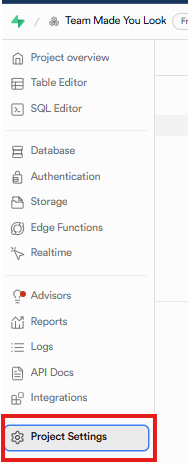
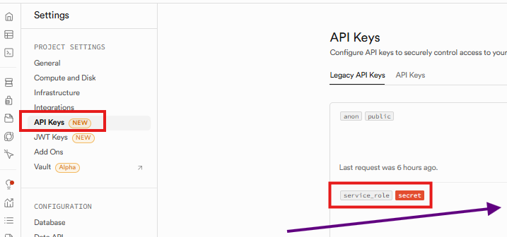
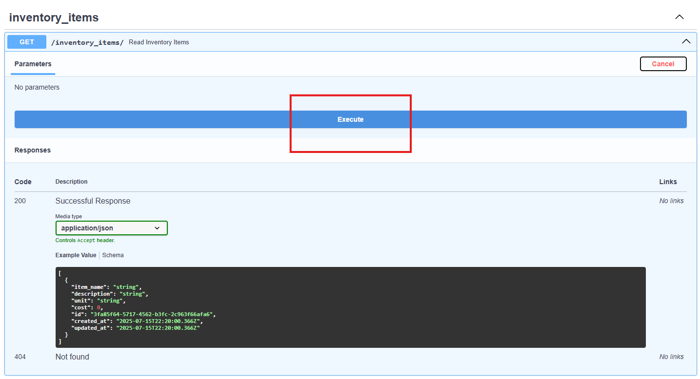
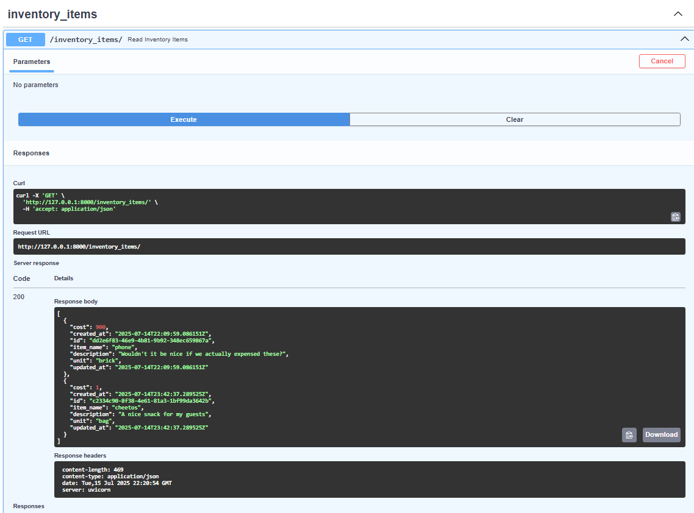

# 🚀 FastAPI Project Setup Guide

This guide will help you get the FastAPI server up and running using [`uv`](https://github.com/astral-sh/uv), a modern Python package manager and runtime.

---

## 📦 Step 1: Install `uv`

If you don't already have `uv` installed, you can install it with one of the following methods:

### MacOS / Linux

```bash
curl -Ls https://astral.sh/uv/install.sh | bash
```

### Windows (PowerShell)

```powershell
irm https://astral.sh/uv/install.ps1 | iex
```

Alternatively, check out the [official uv installation docs](https://github.com/astral-sh/uv#installation) for more options.

---

## 📥 Step 2: Install Dependencies

Install the project dependencies using:

```bash
uv add -r requirements.txt
```

Run this command to sync and update/remove dependencies as indicated in both the `requirements.txt` and `pyproject.toml`

```bash
uv sync
```

This installs everything listed in `requirements.txt` and locks them using `uv.lock` for reproducibility.

---

## 🖥️ Step 3: Run the Server
### Start the Server
Start the FastAPI development server to run your server:

```bash
uv run uvicorn app.main:app --reload
```
> This will automatically create a `.venv` folder for your project if one doesn't already exist.

---

### Access the API 
Once the server is running, open your browser and navigate to:

```
http://127.0.0.1:8000
```

Or hold `Cmd` (Mac) or `Ctrl` (Windows/Linux) and click the link in your terminal.

### 📚 Access the API Docs (Swagger UI)

Once the server is running, FastAPI auto-generates interactive API docs at:
- Swagger UI: [`http://127.0.0.1:8000/docs`](http://127.0.0.1:8000/docs)
- ReDoc: [`http://127.0.0.1:8000/redoc`](http://127.0.0.1:8000/redoc)

#### To test an endpoint:
1. Go to `/docs`
2. Scroll to the endpoint you want to test
3. Click on it to expand
4. Click the "Try it out" button on the right
5. Enter any required parameters
6. Click "Execute"
7. Scroll down to view the response from the server

_This is super helpful during development to verify everything is working as expected._


---

## Step 4: 🔐 Configure Environment Variables

We use a `.env` file to manage configuration, like database URLs.
1. Go to **Supabase > Database > Connect**
  * 

2. In the modal that appears, look for the **Direct Connection** section at the top:
  * 

3. Use the `.env_example` file as a template to create your own `.env`. _Also mentioned in next step._

4. Set the `DATABASE_URL` environment variable using:
    - The **DB password**
    - The **hostname** shown under **Transaction Pooler**

---

## 🔑 Step 5. 🔐 Authentication (JWT) Setup

We're using Supabase's built-in authentication system to manage users (both customers and providers). Supabase issues a JWT (JSON Web Token) whenever a user signs in — we decode this token to identify the user in our FastAPI app.

### ➕ Add the JWT Secret

> To enable this, you must set the SUPABASE_JWT_SECRET in your .env file. This secret allows FastAPI to validate and decode incoming tokens securely.

To get your secret:
1. Go to your Supabase dashboard

2. Navigate to Project Settings → API



Use the service_role token that's provided to the right of this screenshot (just out of picture)


3. Look for the value under JWT Secret

4. Add it to your `.env` file as shown in the `.env_example`

>Note: This is the same secret Supabase uses to sign tokens, so your backend can safely verify them.

### ⚠️ Auth Routes Not Fully Functional Yet

Endpoints like `POST /customers`, `POST /providers`, and any route under `/me` require a valid `Authorization` header with a Supabase-issued JWT.

✅ These routes are scoped to the logged-in user  
❌ Full login functionality (e.g. Google Auth) is **not yet implemented**

Until auth is hooked up, these endpoints won’t work through normal API calls or Swagger UI.

---

### 🧪 For Testing: Use [`/docs`](http://127.0.0.1:8000/docs)

To explore the API interactively, visit [`http://127.0.0.1:8000/docs`](http://127.0.0.1:8000/docs) once your server is running.

We recommend starting with the `/inventory_items` routes — they **do not require authentication** and are safe to test directly via Swagger UI.

On the Swagger UI page, expand the `inventory_items` section


Swagger makes you work, so click **"Try it out"**


Select the gigantic **"Execute"** button


You know it works if you are able to pull open the same information as what shows on the `inventory_items` table in Supabase!


> Happy Swaggering!

---

### 🔧 Dev-Only Auth Workaround

To simulate a logged-in user during local development, we've hardcoded a static UUID as a placeholder:

```python
# app/utils/auth.py

async def get_current_user() -> UUID:
    return UUID("3fa85f64-5717-4562-b3fc-2c963f66afa6")

```

---

## 🧱 Step 6. Database & Model Setup

We're using [Supabase](https://supabase.com/) (PostgreSQL) as our database.

- We define our database tables using `SQLModel`, a library that makes it easy to work with both Python data and SQL databases.
- Supabase hosts our Postgres database and helps manage performance behind the scenes.
- Settings like the database URL are stored in a `.env` file (as seen in the previous step).

## 🧪 [Optional] Seed the Database
To test your database connection or seed example data (e.g. into the `providers` table), you can run the following:

```
uv run test_db.py
```

### ✅ You're Ready!

You can now build and test your FastAPI backend locally. Happy coding!

---

## 🧰 Dependency Management

### Add Dependencies
```
uv add dependency name
```
### Remove Dependencies
```
uv pip uninstall package-name
uv remove package-name
uv sync
```

---
## 🧯 Troubleshooting

### Can't connect to Supabase?

If you're seeing errors like:

```
psycopg2.OperationalError: could not translate host name ...
```

Make sure your internet connection isn't blocking access to Supabase's cloud database.

We've seen cases where **some Wi-Fi networks block or throttle access**, especially on public or secured networks. If you're stuck:

- Try switching to a mobile hotspot
- Check your firewall or DNS settings
- Make sure `.env` is loading the correct `DATABASE_URL` (i.e. print the string)
