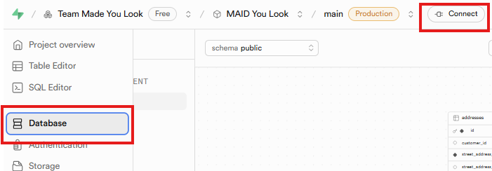

# 🚀 FastAPI Project Setup Guide

This guide will help you get the FastAPI server up and running using [`uv`](https://github.com/astral-sh/uv), a modern Python package manager and runtime.

---

## 📦 Step 1: Install `uv`

If you don't already have `uv` installed, you can install it with one of the following methods:

### MacOS / Linux

```bash
curl -Ls https://astral.sh/uv/install.sh | bash
```

### Windows (PowerShell)

```powershell
irm https://astral.sh/uv/install.ps1 | iex
```

Alternatively, check out the [official uv installation docs](https://github.com/astral-sh/uv#installation) for more options.

---

## 🧪 Step 2: Create a Virtual Environment and Run the App

```bash
uv run main.py
```

> This will automatically create a `.venv` folder for your project if one doesn't already exist.

---

## 📥 Step 3: Install Dependencies

Install the project dependencies using:

```bash
uv add -r requirements.txt
```

This installs everything listed in `requirements.txt` and locks them using `uv.lock` for reproducibility.

---

## 🖥️ Step 4: Run the Server
### Start the Server
Start the FastAPI development server to run your server:

```bash
uv run uvicorn main:app --reload
```

---

### Access the API 
Once the server is running, open your browser and navigate to:

```
http://127.0.0.1:8000
```

Or hold `Cmd` (Mac) or `Ctrl` (Windows/Linux) and click the link in your terminal.

---

## Step 5: 🔐 Configure Environment Variables

We use a `.env` file to manage configuration, like database URLs.
1. Go to **Supabase > Database > Connect**
  * 

2. In the modal that appears, look for the **Direct Connection** section at the top:
  * 

3. Use the `.env_example` file as a template to create your own `.env`.

4. Set the `DATABASE_URL` environment variable using:
    - The **DB password**
    - The **hostname** shown under **Direct Connection**

## 🧱 Step 6. Database & Model Setup

We're using [Supabase](https://supabase.com/) (PostgreSQL) as our database.

- We define our database tables using `SQLModel`, a library that makes it easy to work with both Python data and SQL databases.
- Supabase hosts our Postgres database and helps manage performance behind the scenes.
- Settings like the database URL are stored in a `.env` file (as seen in the previous step).

### ⏱️ TimestampMixin

We've taken common fields like `id`, `created_at`, and `updated_at` and moved them into a reusable class called `TimestampMixin`.

This helps keep our models cleaner and avoids repeating the same code in every table.

```python
class TimestampMixin(SQLModel):
    id: Optional[uuid.UUID] = Field(default_factory=uuid4, primary_key=True)
    created_at: Optional[datetime] = Field(
        default=None,
        sa_column=Column(
            DateTime(timezone=True),
            server_default=text("(now() AT TIME ZONE 'utc')")
        )
    )
    updated_at: Optional[datetime] = Field(
        default=None,
        sa_column=Column(
            DateTime(timezone=True),
            server_default=text("(now() AT TIME ZONE 'utc')")
        )
    )
```

## 🧪 [Optional] Seed the Database
To test your database connection or seed example data (e.g. into the `providers` table), you can run the following:

```
uv run test_db.py
```

### ✅ You're Ready!

You can now build and test your FastAPI backend locally. Happy coding!

---

## 🧰 Dependency Management

### Add Dependencies
```
uv add dependency name
```
### Remove Dependencies
```
uv pip uninstall package-name
uv remove package-name
uv sync
```

---
## 🧯 Troubleshooting

### Can't connect to Supabase?

If you're seeing errors like:

```
psycopg2.OperationalError: could not translate host name ...
```

Make sure your internet connection isn't blocking access to Supabase's cloud database.

We've seen cases where **some Wi-Fi networks block or throttle access**, especially on public or secured networks. If you're stuck:

- Try switching to a mobile hotspot
- Check your firewall or DNS settings
- Make sure `.env` is loading the correct `DATABASE_URL` (i.e. print the string)
