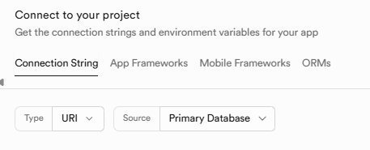

# 🧼 Welcome to Wipe Ripe – Backend (FastAPI)

This is the backend API for the Wipe Right project, built with **FastAPI**, **SQLModel**, and **Supabase**. It supports customer and provider accounts, service listings, bookings, and more.


---

## 📚 Table of Contents

- [⚡ Quickstart](#-quickstart)
- [🆕 First-Time Setup](#-first-time-setup)
  - [📦 Install Dependencies](#-install-dependencies)
  - [🔐 Configure Environment Variables](#-configure-environment-variables)
- [🧰 Prerequisites & Tooling](#-prerequisites--tooling)
- [▶️ Run the Server](#-run-the-server)
- [📚 API Docs](#-api-docs)
- [🔑 Authentication](#-authentication)
- [🧱 Code Style & Formatting](#-code-style--formatting)
- [🧯 Troubleshooting](#-troubleshooting)

---

## ⚡ Quickstart
Already cloned the repo and set up your `.env`?

Just run:

```bash
uv sync
make run
```
Or if `make` is not installed:
```uv run uvicorn app.main:app --reload```

> This will automatically create a `.venv` if one doesn't already exist.

---

## 🆕 First-Time Setup

If this is your first time working on the project, follow these steps to get your backend environment up and running.

### 📦 Install Dependencies

Install everything you need to run the project:

```bash
uv sync                  # Install dependencies from requirements.txt
cp .env_example .env     # Create your .env file (configure it in the next step)
make run                 # Start the FastAPI dev server
```
Or if `make` is not installed:
```uv run uvicorn app.main:app --reload```

> This will automatically create a `.venv` if one doesn't already exist.


### 🔐 Configure Environment Variables

We use a `.env` file to manage secrets and environment-specific settings.

1. Go to **Supabase → Database → Connect**
   - 

2. In the modal that appears, look for the **Direct Connection** section.
   - 

3. Copy the example `.env` file to get started:

- **Mac/Linux/WSL/Git Bash:**
  ```bash
  cp .env_example .env
  ```
- **Windows (CMD):**
  ```commandline
  copy .env_example .env
  ```

4. Open `.env` in your editor and replace the placeholder values with your own:
* `DATABASE_URL`: Use the credentials from the Transaction Pooler section
* `SUPABASE_URL`: Your Supabase project URL
* `SUPABASE_PUBLISHABLE_KEY` and `SUPABASE_SECRET_KEY`: Found in Supabase → Project Settings → API

> The `.env` file is ignored by Git — each team member must configure it locally.

---

## 🧰 Prerequisites & Tooling

This project assumes you're using **VS Code** as your editor.

### ✅ Required Tools

| Tool         | Purpose                         | Install Command / Link |
|--------------|----------------------------------|-------------------------|
| [`uv`](https://github.com/astral-sh/uv)         | Python runtime + package manager | **Mac/Linux:**<br>`curl -Ls https://astral.sh/uv/install.sh \| bash`<br>**Windows (PowerShell):**<br>`irm https://astral.sh/uv/install.ps1 \| iex` |
| `make`       | Task runner for common scripts   | **Mac/Linux/WSL/Git Bash:** Already installed<br>**Windows (CMD/Powershell):*** `choco install make`<br>✅ To confirm `make` is installed, run: <br>`make --version`|
| `.env` file  | Local env variables              | Copy `.env_example` to `.env` and configure manually |

> * _Note: you will need to run this as an Administrator (i.e. right-click on the CommandPrompt program before opening it and Run as Admin_)
---

### 💻 VS Code Extensions (Recommended for full workflow)

- [Makefile Tools](https://marketplace.visualstudio.com/items?itemName=ms-vscode.makefile-tools)
- [Python Extension](https://marketplace.visualstudio.com/items?itemName=ms-python.python)
- [Ruff (Linter)](https://marketplace.visualstudio.com/items?itemName=charliermarsh.ruff)

> 💡 **To experience the full developer workflow**, install all of the extensions above and open the `backend/` folder in VS Code.

VS Code will auto-detect `.vscode/settings.json`, which enables:

- ✅ Format on save using `black`
- ✅ Lint on save using `ruff`
- ✅ Sort imports using `ruff`

---

## ▶️ Run the Server

Once your dependencies and environment variables are set, you can start the FastAPI development server.

### ✅ Using Make

```bash
make run
```

**🛠️ Without Make**
```
uv run uvicorn app.main:app --reload
```


> **This will start the server on http://127.0.0.1:8000**
>
> You’ll see logs in your terminal showing the server is running. To stop the server, press Ctrl + C.

---

### You're Ready!

You can now build and test your FastAPI backend locally. Happy coding!


---


## 📚 API Docs

FastAPI automatically provides interactive API documentation:

- **Swagger UI**: [http://127.0.0.1:8000/docs](http://127.0.0.1:8000/docs)
- **ReDoc**: [http://127.0.0.1:8000/redoc](http://127.0.0.1:8000/redoc)

### 🔍 How to Test

1. Visit `/docs` in your browser
2. Find the route you want to test
3. Click "Try it out"
4. Fill in any required parameters
5. Click "Execute"
6. View the live response from the backend

This is useful for testing endpoints during development, especially for unauthenticated routes like:

```http
GET /inventory_items
```

> If your route requires authentication, you'll need to include a Supabase JWT token in the `Authorization` header.

---

## 🔑 Authentication

We use **Supabase Auth** to manage user authentication for both customers and providers.

When a user logs in (e.g. via Google), Supabase issues a **JWT (JSON Web Token)**. This token is passed in the `Authorization` header on each request:

```
Authorization: Bearer <JWT_TOKEN>
```

**The FastAPI backend:**
- Validates this token using Supabase’s public signing key
- Extracts the authenticated user’s ID
- Scopes data access based on that user ID

### ✅ Auth Status

- Google login is enabled in the frontend via Supabase
- Backend authentication is fully functional
- All user-scoped routes (e.g. `GET /providers/me`, `POST /customers`) require a valid Supabase token

### 🔐 `.env` values needed for auth:

```env
SUPABASE_URL=https://<your-project>.supabase.co
SUPABASE_PUBLISHABLE_KEY=sb-publishable-key-goes-here
SUPABASE_SECRET_KEY=sb-secret-key-goes-here
```
You can find these values in your Supabase project under `Settings` → `API`.

---

## 🧱 Code Style & Formatting

This project uses:

- [`ruff`](https://docs.astral.sh/ruff/) – for **linting**, **formatting**, and **import sorting**

### 🔧 Common Commands

| Task            | Makefile Command      | Direct Command |
|-----------------|------------------------|----------------|
| Format code     | `make format-all`      | `ruff format . && ruff check . --fix` |
| Lint code       | `make lint-all`        | `uv run ruff check .` |

### 🎯 Target a specific file or folder:

```bash
uv run ruff format app/models/customer.py
uv run ruff check app/routers/ --fix
```

> Linting and formatting settings are defined in pyproject.toml.
> VS Code uses .vscode/settings.json to enforce format/lint on save.

---

## 🧰 Dependency Management

We use [`uv`](https://github.com/astral-sh/uv) to manage dependencies and virtual environments.

### Add a dependency

```bash
uv add package-name
```
This will install the package and update both `requirements.txt` and `uv.lock`.

### Remove a dependency

```bash
uv pip uninstall package-name   # removes the installed package from your environment
uv remove package-name          # removes it from the lockfile and requirements
uv sync                         # final cleanup to sync everything
```
> Always run `uv sync` after modifying dependencies to ensure your environment stays in sync with the lockfile.
---

## 🧯 Troubleshooting

### 🔌 Can't connect to Supabase?

If you see an error like:

```
psycopg2.OperationalError: could not translate host name ...
```

**Try the following:**

- ✅ Double-check your `.env` file — especially `DATABASE_URL`

---

### 🛠 Other Tips

- ❌ `make: command not found`
  → Run `make --version` to confirm it's installed. On Windows, use **Git Bash**, **WSL**, or install `make` with Chocolatey (`choco install make` as Administrator).

- ❌ `ModuleNotFoundError`
  → Make sure you've run `uv sync` and you're in the right virtual environment (`.venv`).

- ❌ Swagger UI not loading?
  → Ensure your server is running at [http://127.0.0.1:8000](http://127.0.0.1:8000) and reload the page.

> Still stuck? Drop a screenshot and we’ll debug together 💬

---
